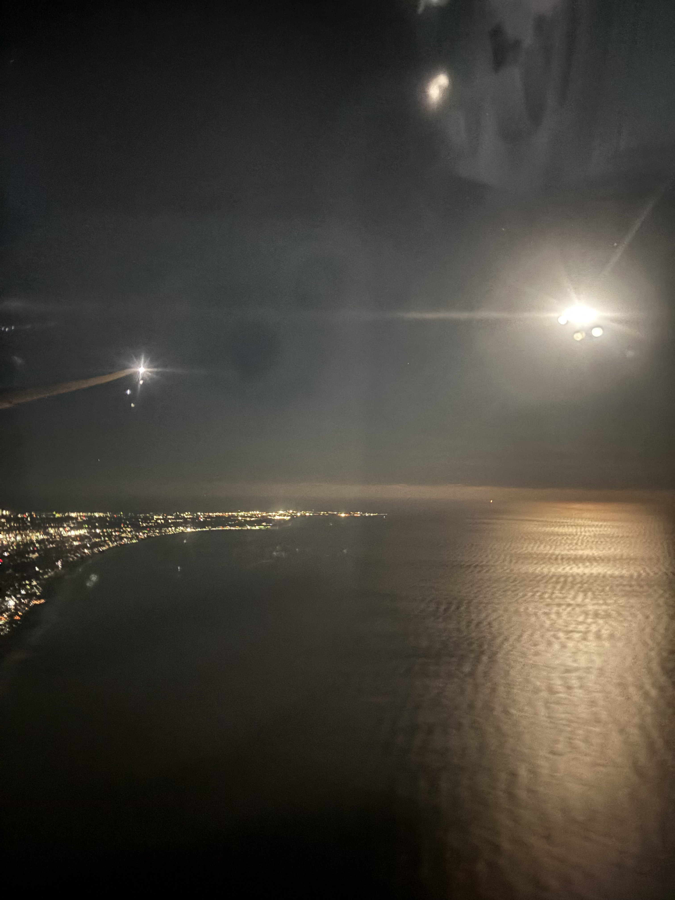
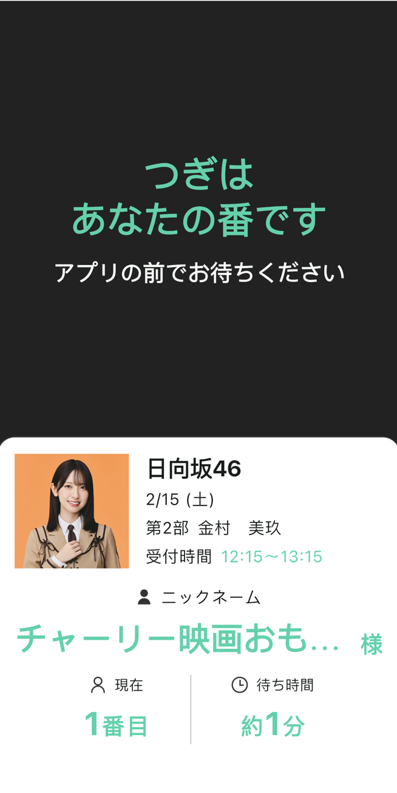

（读前提醒：本文包含大量偶像宅用语，且出现多次本人露脸的切奇，切勿在吃饭喝水时阅读。）

推しは推せる時に推せ，翻译成中文大概是“自己的推，就应该在还能推的时候多推”，无论是日文还是中文，这句都像是绕口令的话想传达的便是一个及时行乐之意：经济上、时间上允许的话，就多去见见自己的推吧，别等到毕业了才感到后悔。因为后半这层后悔的意思，这句话之前经常在偶像，尤其是坂道系偶像毕业隐退的时候看到，毕竟之后就很难见上一面了。不过今天引用这句倒没有后悔伤感之意，恰恰相反，这篇博客记录了我对这句名言的及时性的践行。

是的，我去进行推し活了。十二月开完会回来后，怎么都惦记着最后一次在柏の葉跟りほ说好的明年找她过生日的事情，出现了初期的入脑症状，正好20号当天有一个[marquee祭](https://x.com/MARQUEE_matsuri/status/1877550933040623785/)而几天前有[HEROINES VALENTINE](https://x.com/heroines_idol/status/1879142841416618339/)拼盘，这下不仅可以找她过生日还可以过情人节，属于是意外之喜。一番操作后，在一个圣地亚哥的雨天坐上直飞成田的JL65，开始了这段旅程。

今年年初的美国航空业很不太平，事故是以daily的频率在发生，我出发这天圣地亚哥下着小雨，只有一条跑道的SD机场直接崩溃，我的航班准时登机，但是一直在跑道上呆了四个小时到下午三点才起飞，同时，当我在安检的大比队里排着的时候，一家美国海军的军机坠在了SD的海域了，保持了不太平的航空业事故streak。因为天气延误而增加到十五个小时的跨洋航班简直就是牢狱，好在认识了旁边坐着的一位来美国访学的医生，和她聊天打发了不少时间。35岁才开始读PhD，但是却在这十几个小时的旅程中读了估计30+的文章，还顺手做了个slides，而我打开一篇OSDI看了不到十五分钟就步入梦乡了，热情确实亦有差距。到达成田的时候已经是七点多，加上成田狗屎一样的入境体验，到达酒店入住的已是十点多了，吃点东西喝点酒，看了一集ave mujica的第七话，剧情从这里开始混沌了起来，还实时看到了C团上FIRST TAKE的CM，更是难绷。

千叶的海岸线

 

醒来便是2月14日，情人节，仔细一想虽然快30了，但这居然是我第一次有安排的情人节，还是挺哭笑不得的。说到情人节当然是巧克力，于是我便跑到轻车熟路的三越前食品街选购巧克力，映入眼帘的便是各种包装精美的巧克力，一直单身的弊端之一也许就是没法试这些丰富的巧克力吧。随后专程去了一趟秋叶原找ACAね在街机厅留的签名，最近也是非常的推ACAね。

打发了一些时间后，前往本次情人节拼盘的举办地，东京巨蛋--旁边的TOKYO DOME CITY HALL，这一块儿也是属于多次路过但是从来没看过活动的地方，这次也算开了先河，希望之后能去东蛋看看live。入场后离nonfic的时候还有3个团，在场馆里找座位的时候路过了i-COL的特典会，ice还是一如既往的大比队，但是colne的队伍看起来很manageable，于是本次旅行第一次拍切居然是和colne，但是并不让人满意，原因有不少，比如有我非常讨厌的隔断用的帘子，比如我和colne绝非熟（只能聊非常浅的话题），比如i-COL本质上是iLIFE的严格子集，所以推的极快，一瞬间我甚至以为是在参加坂道的全握，两张带签特典券可能一分钟都没聊到就结束了。这不好的开头无疑给本次旅行蒙上了一层阴影，毕竟colne也是nonfic的成员，要是待会nonfic也是这个流程怎么办。

前两天我都是买的前方票，而且今天是个工作日，所以几乎没费任何功夫就在前方第二排（杆位正后方）左侧拿到一个不错的位置，然而live一开始我才想起来nonfic的live里riho出场都是在舞台右边。如之前推特预告的一样，今天的服装是一套粉色的女仆装，挺可爱（但是没想到后两天的更可爱）。时隔两个月再次见到舞台上的riho跳二步的瞬间，感觉折腾这么大个劲儿跑过来是值得的。不过歌单并不是最优（是的有粪歌），再加上工作日的下午，场馆也没塞满，MIX的音量也不够大，所以作为第一场live，可以说是及格水平，当然，我也逃不掉干系，毕竟我戴着口罩在前面地藏了一整场，就那几首歌的时候稍微振付了一下。

结束后自然是特典会，第一次见到nonfic买券原来是这么长的大比队，不过也正常，之前十二月的时候都不是第一时间跑去排特典券，轮到我的时候我掏出2w现金说带签的5张带评论的3张，正好1w9你找我1k就好，结果staff用看傻逼的眼神看着我说限购3+1，草，给我整不会了。总之带着第一轮的四张去排队，riho的队肉眼可见的比12月的时候要长了，怎么回事，排我后面的是个长相就很靠谱的大哥，于是问了他nonfic这个限购到底是什么机制，他非常耐心的给我一五一十的讲清楚了，借着这个话题和他聊了会儿，从nonfic相关知识到洛杉矶山火到我给他推荐上海地偶，顺手也就加了大哥的推特，发现果然是个几乎每场都去的饭头。

聊着聊着也就到我了，此时我还戴着口罩，但上一个人刚走，riho就开始朝着我这边大喊查理查理，而我上一秒还在担心时隔两个月她还能记得我吗，被她先发制人已经让我很是惊喜，但下一秒发生的事情更令我意想不到。我走到她旁边，准备说我构思好的话题，然后她直接对我说：“你最近是不是加推了？”我的节奏全乱了，一脸懵逼的看着她，没啊，“我看了你的推特”，她接着说，“よるあみ的那个”，我这才反应过来她说的是我之前随手关注的みぽたぽた（不过她们前阵子有过2-man live，riho还和她交换了衣装），这实在是恐怖如斯，想不到她居然视奸我的推特，还看我关注列表。我一般在特典会前都会内心模拟一下，如果我提出这么一个话题，她大概会如何回答，这也是我平常和人聊天时候常用的技巧，有助于保证整个对话在一定误差内符合我的期望，不至于跑的太开让我无法接上，但这一次是怎么也不可能想到，时隔两个月后的再会居然是这样的展开。我连忙解释那只是随手点的关注，她紧追不舍的问我是不是只单推她，用很不恰当的比喻描述就是有一种被捉奸在案的负罪感。这么一出意料之外的对话让我几小时前的担忧直接烟消云散，直接入脑。

一轮算上入场特典最多用三张券，入脑之后我立刻又去买了几张，此时riho队伍的人数已经不多了，有助于我循环起来。我问她能不能收巧克力，果不其然政策规定了不能收，但没关系，我们可以拿着拍切，于是便有了下面这张我人生第一次送巧克力/收巧克力。拍完后她拿着盒子左看右看，迟迟不开始签切奇，依依不舍的说真想吃但是没办法根据相关法律法规还是得还给你，我说没事我可以帮你把你的份吃了。还和她说想在live的时候被她指，她说你明天去搞个荧光棒，把口罩摘了，她一旦看到我就会给我狂发レス，牢记在心。

Adobe Research的衣服显然是地偶场的潮牌

 

几轮下来一共拍了8张加一个入场的写メ，队伍也差不多开始截了，心满意足的结束了这第一天的偶活。能在情人节当天和自己的推零距离线下聊天互动，着实是一件令人着迷的事情，线下真的有着线上永远无法提供的情绪价值，疫情这几年的空白仿佛就在这短短的两个小时内就能弥补回来。带着喜悦的心情，跑到池袋西口北和一个金村ota朋友吃饭，和她分享新鲜出炉的偶活故事，分享果然能传递快乐，她也分享了不少推SWEET STEADY的小故事，是偶像宅味儿非常浓郁的一顿饭。

直到临行前两天，我才发现我居然抽了2月15日的日向坂线上聊天会，而且一共中了四部。在美国的时候线上聊天刚好可以打发无聊的周末晚上时光，但当我物理意义上抵达日本后，需要在白天的活动中见缝插针的进行线上聊天还挺抽象的，尤其是我前一天就买好了《孤独的美食家》剧场版的电影票，十一点开场的一百二十分钟电影刚好和第一、二部全部冲突。不过好在无论是在日本电影院看电影还是线上聊天我都身经百战见得多了，日本的影院和美国一样会放很长的开场广告，这个间隔刚好够提前排队的我在第一部开始后作为第七位进行聊天，我在TOHO日本桥的荧幕外靠着墙和金村女士说我要去看电影了哦，过一会儿告诉你感想，这一部就一张券，在金村女士一脸懵逼“你不会真在电影院吧”的疑问中结束了。

孤独的美食家电视剧版是几乎没有主线剧情的单元美食剧，这部剧场版有着一个自圆其说的主旋律故事，结尾令人暖心，不过作为美食番，剧场版里出现的食物我几乎没有特别想吃的，因为高光食物不是韩餐就是拉面，全程我最想吃的居然是飞往法国的JAL航班上的航空餐，而且我和叔一样，都没吃到牛肉套餐，原因略有不同：叔在剧中是睡过了而我则是坐在最后一排到我的时候只剩鸡肉可以选了。电影播完演员表，没有彩蛋，此时第二部聊天会刚好还有三分钟截队，于是我一边离场一边开始排队，身份验证的时候被staff连线，说你是不是在外面，为什么在一直走动，能不能找一个稳定的背景，重新开始看地偶的我对这种天偶的爹味staff非常不满，慢悠悠的坐扶梯下来，找了个墙靠着开始等待，快轮到我的时候我才发现我站在影院的排片表旁边，今天正好是周末，无数对情侣走到我旁边来看有什么电影正在上映，而隔壁的我则对着手机屏幕准备和偶像聊天，这就是人类社会的多样性。金村女士一见到我，有点生气的笑着对我说，你绝对在逗我玩吧，你真的有看电影吗，不会是整蛊吧，我说我现在还在影院呢，要不是不能给你看路人我就转一圈手机给你看了，还顺便给她推荐了刚才这部片，确实还不错，尤其是配乐。（后来发现是kan sano）

靠着影院墙壁看到的风景

 

下午则要去邮局寄出9月在金村的写真展定的签名复制写真，有一张金村坐在溪流里拍的图拿到实物后才发现大到不可思议，怎么也不能肉身带回去，为了把这张照片运到邮局都打了两次的士（前一夜从朋友家到酒店和今天从酒店到步行9分钟的邮局）。到了邮局后才发现照片的三维已经超过了美国接受的任何邮包的上线，于是无奈只能寄回国内，日本的邮局并不像国内的顺丰一样提供打包服务，基本都是给你材料自己打包，不过接待我的staff非常友善，从告诉我没法寄美国，到中国海关的一些政治、金额上的要求，到帮我给这个巨大的箱子包泡沫纸，最终包完的三维刚好是298.5cm，离国内的300cm限制刚好差一点，花了一个多小时总算也是顺利寄出去了。之后马不停蹄杀去秋叶原买了两根KBX然后奔向会场，上次专门买荧光棒应该还是灰灰的时候了。

其实nonfic第二天是八点左右压轴出场，我这么早来主要是为了看两个团，一个是大人气的iLiFE!，一个则是之前在白金高轮看过一次的ドラマチックレコード，回到美国后因为刷到新居步美的品川推对这个团产生了兴趣，这也是目前人气很高的团（而且不是女主角体制下的）。在看她们之前，先跑到楼上跟金村聊了最后一部，金村应该还不知道我就是在地偶的场地跟她聊天的，有一种偷腥的感觉（。今天因为是周末的原因，舞台后部的ota很齐全，各种MIX口上地下艺都拉满了，导致今天的live体验远超昨天。ドラマチックレコード确实不错，歌也好听，玩法也不少，新居步美148cm小小一只但是确实很可爱，饭撒给个不停，这团给我印象最深的是谢幕的时候不用麦克风直接嗓子干喊谢幕了一轮，很有诚意。之后的iLiFE则是我第一次亲眼观摩现在地偶的顶流，阵势确实足，场子里的人口密度在要开场的时候肉眼可见的提升，mix的音量大到简直就是军call，到了可变三连那首歌时，根本不用台上的唱，第二段开始基本就是下面的ota在唱，很好玩很喜欢。iLiFE结束后我打算出去吃个饭再回来，正好路过iLiFE的宇宙无敌究极巨型大比队开始形成，夸张到连扶梯都停运了，因为队伍会直接封住扶梯。去附近的春日站吃了个猪排，边吃边听身后两个中国坂道粉丝锐评乃木坂六期生。还顺手去神保町定了一个明晚live后的晚饭，老朋友鸭肉店。

吃完回去nonfic的压轴也快了，看了一个夜光性amuse（有昨天riho提到的我新关注的みぽたぽた）和いぎなり東北産（打歌的裙子非常漂亮，像参加晚宴会穿的裙子），正好也就挤到了几乎和昨天一样的前方区域第二排左边，考虑到是周末的压轴，能有这么个位置挺不错了，有两个身高较矮的女粉站我后面被我挡完了，便给她们让了位置，居然还是同担。SE一开场我就想大叫，因为今天的衣服比昨天好看太多，riho戴着贝雷帽扎两个小辫的双马尾，巨TM可爱，然后我突然意识到我可以大叫，我太可以大叫了，member call、MIX都大声叫。第三首歌一开始，riho跳到这边来，在不是自己的part的时候偷偷给我一比个心，这还是我人生第一次拿レス，这种你知道她不是给其他任何人发レス，一定是对着你的感觉真的太爽了。紧接着一首歌之后的间奏她走到舞台这边向观众席伸手，那瞬间不需要思考也知道我要立刻指回去，于是我直接越过第一排的人，把两根白色的kingblade直接快伸到她手上，她应该只要一抓就能拿走，她继续指我，我跳着继续指回去，默契。在前排还能清楚的看见她跳的太high两鬓的头发都被汗水粘在脸的两侧这种细节。

特典会，买券的时候认识了一个台湾来的小哥，他昨天开始推marin，聊了不少。买完之后到riho的队里，此时还没开始，她实在是太high太high了，需要一个staff站在旁边拿着“真白里帆”队列的牌子扇风给她物理降温，硬是把冬天的室内live搞出了一种夏天的野外fes的感觉。跟她聊了十几分钟前新鲜拿到的レス，她向我保证说以后我只要去她就给。还问了一个一直想问的事情，即她手背上常常有的黑色笔记，如我预料的一样，那是她为了记住歌单顺序，MC发言给自己留的笔记，她说自己要是没这个笔记她在舞台上要变成迷子，今天因为是压轴，她的MC不少，整个手背都记满了。还夸她今天的双马尾贝雷帽，夸她今天的舞台表现，有一轮ツーショット的时候突然不知道做啥pose拍照，呆在原地思考的时候，她猛地一个凑近来，脸都快正面贴上了，直接给我老脸一红害羞的缩了回去，而staff恰好捕捉到了这个瞬间，成了我非常喜欢的一枚。刚拍完6张，再上楼的时候特典券居然已经不卖了，我和台湾小哥都准备再买几轮的，崩溃，有一种意犹未尽的感觉。后来细想应该是场馆要求在某个时间点前必须结束所有活动，所以才这么早就不卖券了。

正在播放：日向坂一单

 

日本、或者说亚洲，最美妙的地方便是你能在任何时间找到人约饭，live结束后，我居然和杭州爱马仕群约到了一顿在秋叶原深夜十点开始的喝酒，太魔幻了。见到了好久没见到的摸狗学姐、月华、卡姆、以及浙大学长，gg的好朋友poi和一个刚从美国亚麻转职到日本来上班的群友，除了卡姆和那位群友其实大家都不住在日本，但都在这个周末来日本跑活动，有的是看孤独摇滚，有的是泡爱马仕的联动温泉，也有的是来看地下偶像。我们一直喝酒聊天直到回酒店的日比谷线的终电都开走了，还好京滨东北线和山手线的终电比较晚，能从有乐町站走回去。

16日比起前一天要chill很多，第二天就要跑去新澙看雪了，在圣地亚哥呆了好几年的我完全没有厚衣服，就去优衣库买了传说中的heattech。去了草莓大福店，但草莓大福下午两点才开始售卖。特地跑到早稻田去准备吃一个汤咖哩但是遭遇大长队，于是漫无目标的沿路走了半天走到江户桥，途中只能看到即将午休的拉面店，最后找了一家东升饺子馆吃了个非常有锅气的炒猪肝。准备出发去会场前，对自己这几天见riho都没怎么换穿搭这一事实很不满意，和小偶像见面，还是要想办法把自己也打扮一下，不说达到好看，至少要能看。小红书都说在日本买northface，于是跑到附近的northface买了条裤子，税都没来得及退直奔会场。

这三日拼盘的最后一天买的是一般票，最初买票时没料到自己会连看三天，所以只买了前两天，想起来买第三天的时候已经没有前方票了。周日，外加阵容不错，楼下的floor基本是塞的满满当当，所以就在三楼找了个位置看，依次看了高嶺のなでしこ、夜光性、JamsCollection，都是很不错的团，Jams还有一整首歌可以录。今天的nonfic有着这三天内最牛逼的歌单和最牛逼的live氛围，floor后排直接围了一圈在打艺（后来还认识了里面的うま君），哎一般最神的live我恰巧都在天上。riho今天也是女仆装，带着头饰乖的很，出场跟个巧克力草莓小蛋糕一样，就是我在天上她怎么也没办法看到我给我发レス了，越想越气，这时背后的大屏幕上正好给riho一个Wink特写，被我光速捕捉到，就当是给我的レス了。再三强调这天的歌单确实爽，在三楼都能嗨翻了，甚至还意犹未尽，不过仔细想想好歌都唱完了，再唱下去粪歌就要开始出现了。

吸取昨天的教训，为了防止今天也很早截队，买完一轮特典券后直接再排两轮，然后在转圈的时候碰到了台湾小哥，他也对昨天很不满hhh。这天由于colne接下来要去iLiFE演出，没有特典会，分流导致其他人的队伍都比平时长，排一轮riho大概都要等个十分钟左右。第一轮和她汇报在三楼远眺的live观后感，提了一嘴floor的人今天也玩的好嗨，然后她问我是不是会跑到floor里面去玩的那种ota，太可以是了。第二轮整了活儿，问她最近apple music给我推荐了一部专辑叫Hola! Hola! Summer，歌很好听，就是这封面上有个人怎么看的这么眼熟，riho对此有什么头绪吗。这倒是一句都不是谎言，因为真的是干活儿的时候在电台里推荐到的，一查发现是riho当年在アキシブproject的时候的专辑，这个团在我19年看地偶的时候多次路过没去看过，当时要是随手看一下就和金发riho初见了。riho一边听我在这里下套，一边嘟着个嘴在评论切上狂写，我以为她就要这么糊弄过去了，毕竟可能团内的规定就是不让提前世的，这个话题多少还是有些敏感，结果她突然说“那查理是更喜欢过去的riho，还是喜欢现在的riho，还是说？”，太会了，真的太会了，真的就是当过两次偶像才有这种应变能力，把可能很厄介的话题轻松化解成嘎起话题。当然我也不甘示弱，顺着她的提示说，“不仅过去，现在的喜欢，未来的也会喜欢”。我的回答让她露出了老师提问得到学生满分答案时的表情，还摸了摸我的头作为奖励。第三轮接着上一轮的话题：上一轮聊了非常厄介的话题，你就首絞め来惩罚我吧。本来我是想拍一个让她勒我脖子的pose的，结果她老人家直接把我卫衣帽子一拎，拍出了本次旅程中我最喜欢的切，拍完后她问我诶查理难道说你是一个抖M吗。第四轮告诉她下周四的marquee是我真正的生日，她说我知道啊你之前不是说过吗（之前可是十二月说的），会盛大的帮你庆祝的，敬请期待。

左：展示她的小抄 右：大力riho

 

至此，8张加写メ都拍完了，心满意足的在旁边整理切，突然听到她又在喊“查理查理”，哎呀是在叫我吗，立刻回头，发现是个新来的粉丝，昵称叫chai tea，チャイティー念出来还真就和チャリ挺像的。chai tea桑拍完后也来我这整理切，我们就寒暄了几句，这时已经快到特典会结束的时候了，从队列那边传来了staff的声音“还有要参加真白里帆特典的人吗，还有吗？还有吗？”望过去发现riho刚好切完最后一个女粉，处于罚站状态，好久好久没看到她罚站了，虽然心里非常清楚riho的人气在地偶团里绝不算高，也清楚正是因为这不高的人气才能让我见这么多次聊这么多轮，但见到她罚站的时候还是会心软。要不再拍一张吧，内心斗争的时候staff的声音还在重复“还有人吗？”，像是催促的警钟一样。不管了，于是我迈开腿跑向特典券售卖处，好笑的是我不去没人去，我一去周围好几个粉丝，男的女的都有，跟在我背后就来了。卖券的男staff说时间到了不卖了，旁边的女staff看我跑过来说要不破例卖他一张吧，于是从盒子里拿出收好了的券，卖了我一张带签的，拿着券往回走的时候，蓝色担当piano正好下班，她朝我走来，对我说“跑起来跑起来，再不跑riho就要下班咯”，我跑起来，听到背后刚刚卖我券的女staff朝着走廊的另一侧大喊“riho别走，riho再等等，还有人”，这场面若不是亲身经历我可能只在电影里看到过。“お帰り”，她对着跑到她跟前的我说，刚刚这两分钟内的事全是我脑子一热干的，现在要聊啥我也没想好，就把刚刚piano催我快跑的事跟她复述了一遍，她笑的像个铃铛，好雑的话题，但聊啥都无所谓了，我真的只是不想看她罚站罢了。其他有类似的想法的粉丝追加完后，riho终于下班了，“riho今天到此结束，感谢大家”，她向大家鞠躬致谢，我们鼓掌，然后她就从我们身边走过，边走还边给我挥手，我就这么目送她下了班。这是之前我看SNH48的时候见到的操作，亲身经历还是第一次，这种体验太容易入脑了。作为三天拼盘的收尾，这天的特典会画上了一个心满意足的、远超预期的、有着意外展开的句号。

离开会场，前往我最爱的鸭肉店吃晚饭，此时正好赶上旁边的东蛋的live结束，整个水道桥十字路口全是散场的主流艺人粉丝在等着过马路，我这个东蛋city hall里出来的地偶民也混入其中，由于人实在太多了，甚至看不到对面的信号灯，交警为了指挥，靠着吹哨来控制大家过马路的节奏，吹一步走一步，快变红灯了就节奏加快，很有意思。到店后，昨天帮我预订位置的店员接待了我，让我稍作等待，之前每次来接待我的都是一位埼玉出身的店员，这次两天都没看到她呢，是不是调走了。正如此想着，一个金色头发的店员走过来对我说，诶你不是之前那个多次访问我们店的吗，之前还带了两个朋友来吃过，原来你叫查理呀。她染了头发，也是第一次见到她不戴口罩的样子，但确实是她没错，是之前那位每次都热情接待我的埼玉店员，能被地偶认知不是一件很稀罕的事情，能被异国的饮食店的店员（不过这位埼玉店员可能是这个店的店长）认知则是很少有的事情了。落座，座位上有一张写着我名字的欢迎函，套餐的出品还是一如既往的稳定好吃，还和邻座的穿着刚刚东蛋艺人的T恤的夫妇聊了会天，不过没喝到柚子酒，是唯一的遗憾。离开的时候，埼玉店员问我下次什么时候来，我说说不定两个月之后吧，这样的对话，彷佛我根本不住在大洋彼岸而是就住在首都圈一般。

选了个有头有脸的酒杯

 

满足的特典会，满足的晚餐，满足的情人节周末。

下一场Live是周四在涩谷O-WEST的Marquee祭，这就有三天的休活期。原计划是去青森遛个弯儿，看看雪，临行前突然发现ACAね似乎是新澙出身，立刻调整目的地，去一趟新澙既可研究一下怎样的环境长出了这样的艺术家，雪也能照看不误，还能解锁上越新干线。远离东京的地方的酒店价格真是离谱，定了一个离车站很近的四星级酒店，算上早餐一天35刀不到。新澙给我的第一印象是一个非常chill的城市，比起东京自然是很村，但不像丰桥那样处在消亡的进行时。出发前完全没有安排任何行程，到了现地后，顺着心情和vibe随机应变的探索了不少东西。

刚落地的时候，作为温暖的南加来的游客，面对来自日本海的寒风，完全被击溃，过桥的时候雨伞被瞬间吹烂，难怪本地人在这桥上不打伞。吃过中饭后开始下起新澙标准的小学，只能躲在星巴克里看外面的路人平淡的顶着雪继续该干啥干啥。雪稍微小点后，又顶着大风跑去码头附近的展望台，地方的展望台，肯定比不上skytree或者shibuya sky，但风景也还不错，临走的时候在展望台的厕所里突然开始流鼻血。晚饭在车站附近找了个炸鸡专门店，吃了半只炸鸡，喝了很香很浓郁的鸡汤，结账时发现隔壁小情侣也就吃半只鸡，意识到自己的食量大得像头猪。饭后在车站附近的商场里买了特色酸奶和小蛋糕，返程的路上突然开始下起了鹅毛大雪，六年ぶりの雪。新澙不愧是米乡，酒店的早餐居然提供好几款不同品种的米饭，饭后顶着雪和风逛了公园，神社，日本海沿岸，已经有些适应了。下午去到清酒厂见学，学习了一下清酒的酿造过程，还顺带品了数十种度数风味儿都不一样的酒，有一两款喝起来特别喜欢。临走前帮一个樱花妹给白人当英语翻译，见到了难得的日本人不加掩饰的“得救了”的表情。试酒的时候还认识了一位意大利来的厨师，和他边走边聊逛了半个新澙市。晚上由一顿丰盛的成吉思汗烤羊肉收尾，回到酒店还能在电视上看eyesee最新一集的生放送。仔细一想，倒是也没去啥风景名胜，不过都还算是有趣，这便是我追求的一人旅的醍醐味儿。

回东京的路上，新干线的窗外陆续看到三种雪景，首先是新澙城区附近的，沐浴在冬日阳光下的田上积雪，到長岡附近时，天突然灰下来，雪也明显的下大了，路过越后汤泽时，外面的雪已经大到完全是雪盲状态，除了信号塔什么都看不见，事后看新闻好像说这是整个亚洲的雪都从日本海跑到这来了，有点意思。抵达东京站的时候东北新干线出现线路问题，东京站的新干线部分一整个瘫痪掉。下午去了趟酒店附近的滨离宫恩赐庭园（是的我又住到汐留老家去了），发现早樱居然已经开了，这才二月中旬呢，赶紧掏出riho的切来合影。

第二天是自己生日，人生第一次想请自己吃顿饭，说起来这趟旅行下来已经有好多第一次了。但是nonfic明天在marquee祭是倒数第二个出场，终演后物贩全部弄完估计得11点了，大部分的能预约套餐的店应该都不serve到这么晚，那就索性提前一天吧。在tabelog上研究了半天，最后定了一个东大附近的百名店，做的是fusion料理，让我印象最深刻的居然是最后的一碗拉面，面条非常普通，但是汤底是类似法式料理做法的汤底，味道复合但香气十足，吃出了日式拉面没有的美味，除此之外，主菜的鸭肉也非常好吃，但店里的光线非常暗（比起饮食店更像是bar的打光），导致拍出来的食物并不好看。

生日当天，有一个一直非常想整的活儿，那就是让推给我送生日蛋糕，今天的marquee的入场特典正好还是10秒视频，所以不仅可以拍静止的拍立得，还可以把整个过程用视频录下来。当然，正如前文提到的，运营的规定让送巧克力都不行，更别说让她准备一整个蛋糕了，但没有问题，我可以准备蛋糕让她送。跑到东京站附近吃个汤咖哩后，就在附近的大丸百货商店街开始买蛋糕，这一逛不得了，东京站特色香蕉小蛋糕，JAL头等舱同款的巧克力点心，过于丰富的选择让我差点迷失了自己，还在逛的过程中喝到了最近喝到的最好喝的blend咖啡（ROKUMEI）。日本这儿的流行做法是大部分好看的蛋糕都得提前一周预订，但我还是货比三家在某个窗口找到一个外观上让我满意的、有现货的蛋糕，特地和店员说要多放几个冰袋，毕竟大概率要在locker里撑过一整个Live。蛋糕安排好后，下午去地下铁博物馆转了转，去的路上发现原来附近就是当年奥黛丽在日向坂综艺里提到的那个葛西临海公园。博物馆门票才200块，内容很丰富，可以看到最早的丸之内线的车厢、掘进机，最近办纪念日活动，有一整个东京地铁的可运动模型，还搭配解说，随着解说的声音看着一条条熟悉的线路动起来，自己也和旁边来参观的小朋友一样激动，还去体验了一下驾驶银座线，基本上都是自动驾驶，只有刹车考验一些技术，毕竟要把车门对其不是一件简单的事。

之后就是本番了，从银座的酒店提着个蛋糕，一路坐到银座线的终点，还要穿过涩谷恐怖的人流，来到飘着酒精味儿的道玄坂的livehouse，这件事怎么想都有点变态。入场后摸着黑把蛋糕塞进了locker里，大小刚刚好。一进来又又又拿到了左边第二排，简直就是我的NPC刷新地点，O-WEST的音响正对着我输出，低音炮搞得我心脏不舒服。前两个团都不认识，到了第三个便是ドラマチックレコード，她们在小场地比几天前在TDC发挥更好，无论是live本身，还是饭撒，还是我很喜欢的她们的谢幕，都解释了她们为什么是现在最火的地偶团之一（我看好她们成为下一个白布或者26）。到nonfic时人流明显剧增，人多到差点都守不住自己的位置了，即使这样还是能拿到レス还是比较牛逼的，live的时候明显能听到floor后面那帮白衣瘦子来稳定运转了，mix声大的惊人，估计和TDC后面是同一帮人，以后有机会想加入他们一起玩。

nonfic结束后，去楼下的罗森买水，发现有一款罐装的酒已经卖光了，太可怕了道玄坂。物贩非常之迷惑，我在场馆内排了半天发现排错队伍了，nonfic的要出门下楼。TDC第二天提前关门不卖券的情景还历历在目，再加上今天是本次旅行的最后一天，怎么都要多切几张，正巧听到正后方的哥们说他只买一张券，就试着问了问小哥能不能帮忙用他的限额，帮我买两张，小哥非常热情的答应了，这下一轮就能买到6张券，非常不错。第二轮时想如法炮制，结果后面的老登义正严辞的拒绝了，只得多排了两轮，手握5张签4张评论上楼开始排队。

第一轮上来，她见到我就开始祝我生日快乐，令人感慨，多久没被人面对面说这句话了，告诉她我准备了蛋糕，待会的视频券就麻烦她递给我了，然后话题就被她带偏到了蛋糕是什么口味的，还给我普及蛋糕的日语，什么shortcake，切片蛋糕等等，猜口味的时候她直接暴力枚举，枚举到葡萄的时候我突然脑子一抽“很近了很近了“，但其实桃子和葡萄的日文差远了，给了她一个错误的提示，直到结束前她还在问我到底是个什么味儿的，怎么还没猜到。这轮结束后，从locker里拿出蛋糕，在快要排到我的时候半蹲在地上开始拆解盒子，一瞬间感觉周围很多目光投过来，当我端起蛋糕时目光更多了，确实这个活儿有点神人了，但感觉还挺帅的。她看到蛋糕，对刚才没猜对念念不忘，说这不是有草莓吗，那就算是草莓蛋糕，说实话，桃子做基底的蛋糕确实还是太少见了。10秒视频券，却一共拍了17秒，因为她没听到开始，就端着蛋糕一直对着镜头点头整理表情，开始后就用整个会场都能听到的巨大音量祝我生日快乐，把蛋糕送给我，然后要我多吃多长大（？）。拿着蛋糕还拍了两张切，一张是两个人一起张开血盆大口吃蛋糕，一张是从她那收到蛋糕，每一张我都很中意。拍完后我直接哇啦哇啦跟她聊天，然后她非常委屈的看着我说手里拿着蛋糕没法给我签刚刚拍好的带评论的切，给我整得爆笑了。第三轮跟她老实交代明天就要撤了，要她在我下次来之前一定不要突然就毕业了，还找她要了一个お守り，保佑回美国一切顺利，她问我飞机要坐多久，我说来的时候延误了坐了十五小时，给她惊吓到了，毕竟大部分之前的跨国粉丝也就是大陆台湾韩国来的比较多，跨大洋还是离谱了一些。准备第四轮的时候，已经没啥人了，队伍里有个女粉好像和我杠上了，我排一轮她一定也要跟着排一轮，估计也是想拿关门，于是我就把一轮用的张数降低到了一张，多转几轮也无所谓。第四轮不知道要拍啥，她说把你眼镜摘了，然后唰的一下就戴到自己脑袋上去了，你别说她戴眼镜还蛮好看的，然后跟我说这下我也送她眼镜当礼物了，太会了，真的。我提了一嘴下次来见她前想瘦下来一点，她说诶查理你很胖吗，我确实没想到穿个卫衣意外的把自己伪装成了一个瘦子，然后就感受到肚子被人戳了，她边戳我肚子边拟声词“ムニムニ”，笑死。最后一张，一合计来了一张她拉着我的“查理不要走”，是我非常非常喜欢的一张，拍完就说这是可能目前为止最开心的生日，但真的不想走，要是是日本人该多好，她说感觉我已经是半个日本人了，然后一秒钟后就说了一个我听不懂的单词，“诶查理你听得懂这个词吗，是不是有点难了”，草。和她约好差不多过两个月再来见她，这时我以为特典已经落下帷幕了。

整理切奇，整理蛋糕，nonfic的人开始陆续下班了，第一个是piano，然后是touka，流程也很熟悉了，她们对着粉丝说今天到此结束，鞠躬，然后我们鼓掌，和TDC不同的是她们都跑到我们面前来晃了一圈再离开。之后就是malin和riho，riho也过来晃了一圈和我们打招呼，走到我跟前，抓着我的手，说“下次见”，嗯，然后才走staff通道离开。一时间高兴到不真实，仿佛在梦里。之后还在会场里呆了一会，送了nonfic剩下的colne和haruka下班，还认识了坐在locker旁边的うま和刚刚帮我买券的那个小哥しら，他们一见到我就是：你就是刚才那个被巨大音量送了蛋糕的人。

至此，今天的marquee祭终于是结束了，恍如隔世，上一次marquee还是2019的6月，在对面的O-EAST，那时还没被Spotify冠名，彼时我还把two-shot当成了付一次钱可以拍两张照片，六年前我在沉迷地偶，六年后我还在沉迷地偶，人生仿佛就像莫比乌斯环一样，看似改变了，但兜兜转转又回到了起点。不过无论如何，这确实是一个开心而难忘的生日夜了。

21号的飞机在下午五点，但是又是千叶机场，所以早上起来买点东西，吃个饭就差不多要撤了，不过三越前商店街卖的这个鸡蛋三明治和草莓三明治真的很好吃。历时8天，回到熟悉的圣地亚哥，一段非常短暂的旅行，一段起因很单纯的旅行，单纯就是想见见自己的推了，别无其它想法，也没有计划与安排。庆幸自己尚且年轻，还有精力奔波，还有着能够感受到这种兴奋的能力，钱花掉了还可以再赚，但回忆不会凭空长出来，咬住时间的秒针，抓紧推自己的偶像。